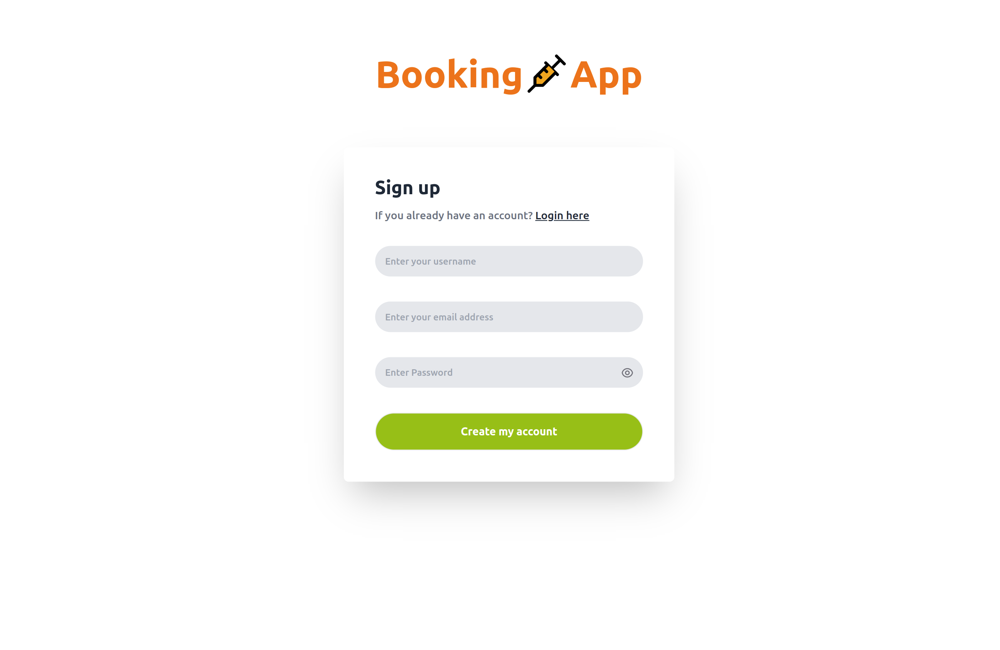

# Booking-app-frontend

This app uses a Rails back-end as an API to send doctor details and appointment data to the frontend of a booking application.

Connect to our [API](https://github.com/Melaku05/booking-app-backendpstone/blob/main/projects/business_requirements.md) or design and connect your own. Enjoy your Booking App!

## Live server
[Demo](https://booking-app1.netlify.app)

## Link to RAILS BACKEND

[RAILS BACKEND](https://github.com/Melaku05/booking-app-backend)

## Built With
- Rails-Booking-App API
- REACT
- REDUX
- Thunk

## Milestones

[Project Requirements](https://github.com/microverseinc/curriculum-final-capstone/blob/main/projects/business_requirements.md) - distributed into milestones below:

### Booking-app-frontend
- [x] Milestone 1: Setup the project for the frontend (group task)
- [x] Milestone 2: Node package manager dependencies (group task)
- [x] Milestone 3: Create login page (group task)
- [x] Milestone 4: Create navigation panel (group task)
- [x] Milestone 5: Create main page (Ranjit)
- [x] Milestone 6: Create details page (Melaku)
- [x] Milestone 7: Create Reservation page (Steve)
- [x] Milestone 8: Create my reservation page (Ismail)
- [x] Milestone 9: Create the redux store (group task)
- [x] Milestone 10: Create the doctor reducer (group task)
- [x] Milestone 11: Create the reservation reducer (group task)
- [x] Milestone 12: Create the login reducer (group task)

- [x] Debug linter errors

## Screenshots
### Desktop version

### Mobile Version 

## Getting Started

To get a local copy up and running follow these simple example steps.

## Pre-requisites
- Text Editor | Git and Github set up
  
## Usage
In your terminal, navigate to your current directory and run this code

`git@github.com:Melaku05/booking-app-frontend.git`

Then run:

`cd booking-app-frontend`

Open the project in your favorite code editor. `code .` for VS Code.

### For Local machine please UPDATE your URL
Change the URL to your backend URL in `./helpers/ApiUrl.js`

ex.
`const url = 'http://localhost:3000/';`

### Dependencies
- Run npm install - to load necessary files from package.json

- Then click on `http://127.0.0.1:3000`

### Linter Setup
- Apply Linter checks with the following instructions

* Stylelint: Install stylelint for clean Styles and elimination of related errors.
 Run:`npm install --save-dev stylelint@13.x stylelint-scss@3.x stylelint-config-standard@21.x stylelint-csstree-validator@1.x`
 Afterwards create a `.stylelintrc.json` file and then run `npx stylelint "**/*.{css,scss}"` to check errors. Use `npx stylelint "**/*.{css,scss}" --fix` to fix multiple errors.

* Eslint: To find and fix script errors, run `npm install --save-dev eslint@7.x eslint-config-airbnb@18.x eslint-plugin-import@2.x eslint-plugin-jsx-a11y@6.x eslint-plugin-react@7.x eslint-plugin-react-hooks@4.x @babel/eslint-parser@7.x @babel/core@7.x  @babel/plugin-syntax-jsx@7.x  @babel/preset-react@7.x @babel/preset-react@7.x`
After, create a `.eslintrc.json` file.
Then run `npx eslint .` to print errors. 
Use `npx eslint . --fix` to fix multiple errors.

### `npm test`

Launches the test runner in the interactive watch mode.\
See the section about [running tests](https://facebook.github.io/create-react-app/docs/running-tests) for more information.

### `npm run build`

Builds the app for production to the `build` folder.\
It correctly bundles React in production mode and optimizes the build for the best performance.

The build is minified and the filenames include the hashes.\
Your app is ready to be deployed!

See the section about [deployment](https://facebook.github.io/create-react-app/docs/deployment) for more information.

## Usage

- Login into Booking App with your username
- Click on the list of Doctors to see their specific detailed information
- From Navigation or from details page click 'Reserve' to book an appointment
- Click from Navigation panel, 'My Reservation' to view a list of your appointment details

Enjoy saving time on long appointment calls by using our top ranking appointment booking App!

## Author 1:

👤 **Melaku Eshetu**
- GitHub: [Melaku05](https://github.com/Melaku05)
- Twitter: [Melaku](https://twitter.com/melaku_mel)
- LinkedIn: [LinkedIn](https://www.linkedin.com/in/melaku-eshetu/)

## Author 2:

👤 **Ranjit Luwang**
- GitHub: [@aboongm](https://github.com/aboongm)
- Twitter: [@John_luang1](https://twitter.com/John_luang1)
- LinkedIn: [LinkedIn](https://www.linkedin.com/in/aboongm)

## Author 3:

👤 **STEVE W DAMES JR**

- GitHub: [@githubhandle](https://github.com/steveWDamesJr)
- Twitter: [@twitterhandle](https://twitter.com/Steve88312331)
- LinkedIn: [LinkedIn](https://www.linkedin.com/in/steve-w-dames-jr/)

## Author 4: 
👤 **Ismail Courr**
- GitHub: [@ismailco](https://github.com/ismailco)
- Twitter: [@ismailcourr](https://twitter.com/ismailcourr)
- LinkedIn: [Ismail courr](https://www.linkedin.com/in/ismailcourr)

## 🤝 Contributing

Contributions, issues, and feature requests are welcome!

Feel free to check the [issues page](https://github.com/Melaku05/booking-app-frontend/issues).

## Show your support

Give a ⭐️ if you like this project!

## Acknowledgments

- Hat tip to anyone whose code was used
- Original design idea by [Murat Korkmaz on Behance.]('https://www.behance.net/muratk')

## 📝 License

This project is [MIT](./MIT.md) licensed.
